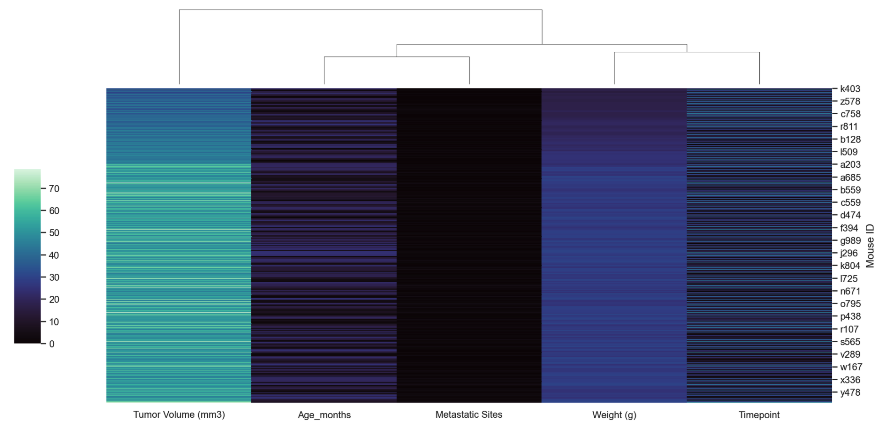
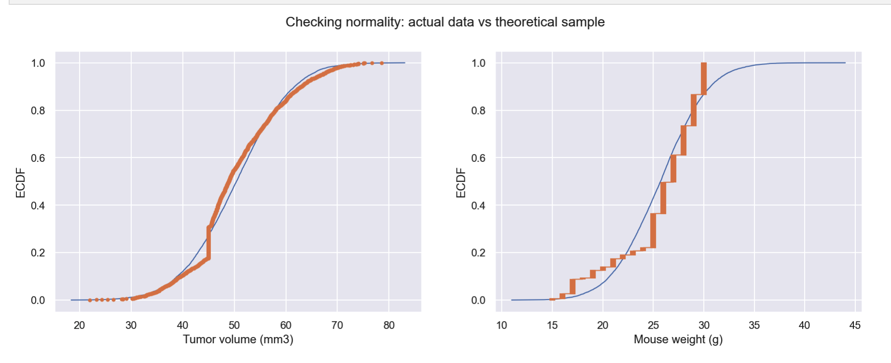
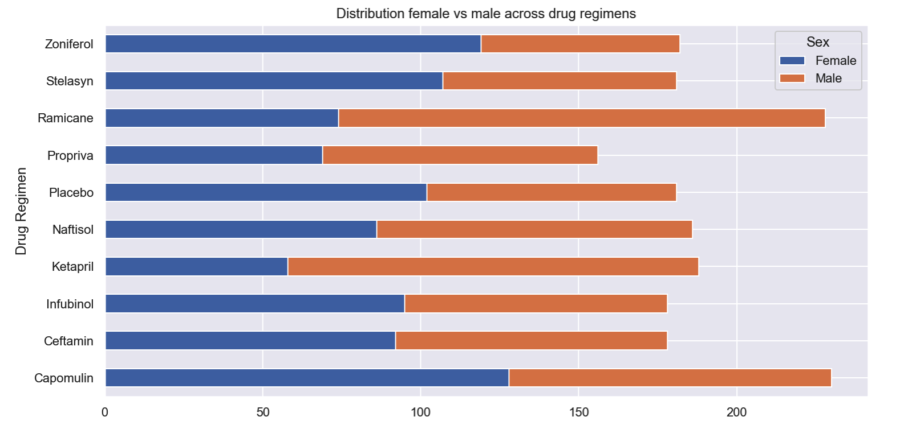
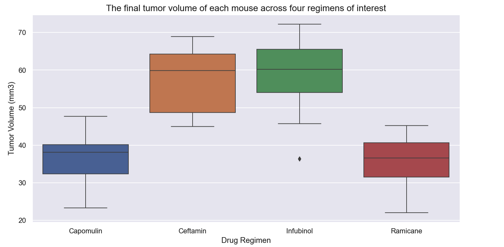
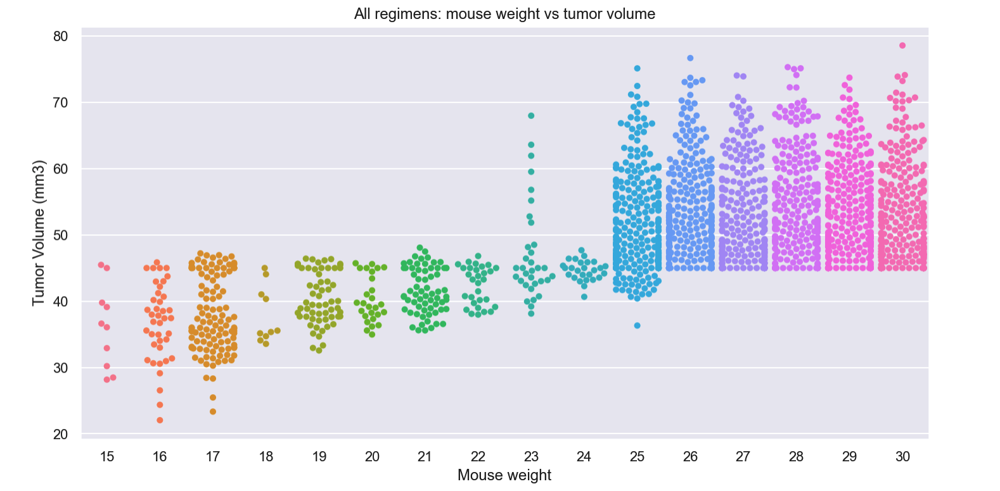

# Matplotlib Case (Power of Plot Challenge Homework Project)

Homework Assignment, Data Science and Visualization Boot Camp (Northwestern University)

## DataSet Description and Basic Summary Analysis

* The most recent animal study observed 249 mice identified with SCC tumor growth were treated through a variety of drug regimens. Over the course of 45 days, tumor development was observed and measured. The purpose of this study was to compare the performance of Pymaceuticals' drug of interest, Capomulin, versus the other treatment regimens. Exploring and summarizing results should include:
    1. Clean data
    2. Exploratory analysis and summary statistics
    3. Calculate the final tumor volume of each mouse across four of the most promising treatment regimens: Capomulin, Ramicane, Infubinol, and Ceftamin.
    4. Calculate the quartiles and IQR and quantitatively determine if there are any potential outliers across all four treatment regimens.
    5. Gnerate a box and whisker plot of the final tumor volume for all four treatment regimens
    6. Calculate the correlation coefficient and linear regression model between mouse weight and average tumor volume for the Capomulin treatment.

## Dataset observations and inferences

#### 1: Tumor volume data normality

M

#### 2: Female vs male mice distribution

#### 3: Final tumor volume across four drug regimens

#### 4: Tumor vs weight across all drug regimens

## Contacts
[Find Me on
LinkedIn](https://www.linkedin.com/in/oleg-n-ryzhkov/)
